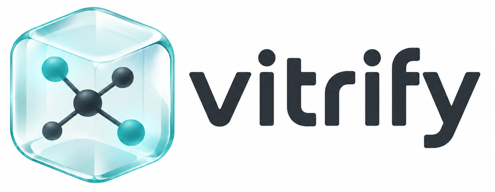

# Vitrify



`vitrify` turns a mutable SPARQL response into a durable, inspectable local file with its query and retrieval evidence.

<div class="grid cards vitrify-workflow" markdown>

-   :material-database: **SPARQL endpoint**

    ---

    Send the exact query to Wikidata's mutable endpoint.

    `https://query.wikidata.org/sparql`

    <span class="vitrify-workflow-arrow" aria-hidden="true">:material-arrow-right:</span>

-   :material-console: **Vitrify command**

    ---

    Capture five EU-capital labels in a local
    [RO-Crate](https://www.researchobject.org/ro-crate/).

    ```sh
    --8<-- "docs/examples/basic-example/input/retrieve.sh"
    ```

    <span class="vitrify-workflow-arrow" aria-hidden="true">:material-arrow-right:</span>

-   :material-folder-open: **RO-Crate directory**

    ---

    The ordinary response file is kept with the exact query and RO-Crate
    evidence.

    {{ directory_preview('basic-example') | add_indentation(spaces=4) }}

</div>

## :material-magnify: Inspect the capture

{{ file_tabs('basic-example') }}

[Full EU-capitals example](examples/eu-capitals.md){ .md-button }

## What is vitrification?

*To vitrify* is to turn something into glass. See also: [**Stanislaw Lem** *Fiasco*](https://english.lem.pl/works/novels/fiasco).

## :material-download: Install

```sh
cargo install vitrify
```
